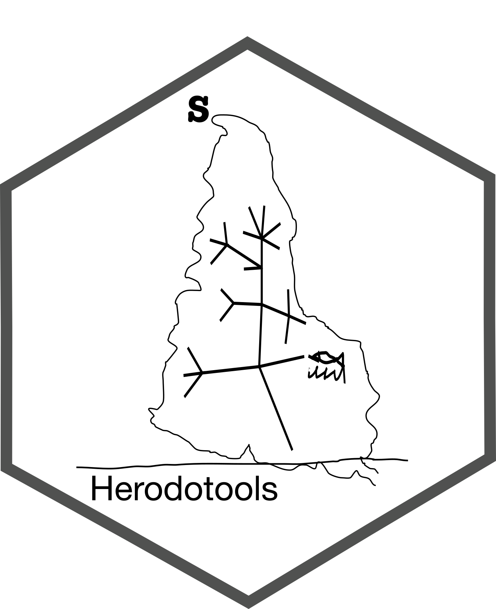

<!-- README.md is generated from README.Rmd. Please edit that file -->



# Herodotools

[](https://choosealicense.com/licenses/mit/)

[](https://zenodo.org/badge/latestdoi/363983380)

# General overview

## History matters - some context on package name and aims

Historical events affect our daily lives in many ways. Who has never
asked what would happen if we had done something different in the past?
Like in the classic movie by Frank Capra [It’s a Wonderful
Life](https://en.wikipedia.org/wiki/It%27s_a_Wonderful_Life), that
latter inspired the book name by the great [SJ
Gould](https://en.wikipedia.org/wiki/Wonderful_Life_(book)), changes in
past events shape our present life dramatically. The same is true in the
natural world, history matters a lot, and species distribution in
ecological communities results from present and past events.

Like the ancient Greek historian and geographer
[Herodotus](https://en.wikipedia.org/wiki/Herodotus), our package aims
to put together tools that allow us to investigate the role of history
systematically. However, instead of narrating stories about kings and
famous battles, we hope to help ecologists to tell their stories of
nature and the nature of history in shaping our biodiversity.

**Disclosure**: The package logo is inspired by a pen and ink drawing by
the Uruguayan artist [Joaquín Torres
Garcia](https://en.wikipedia.org/wiki/Joaqu%C3%ADn_Torres-Garc%C3%ADa)
called [*America
Invertida*](https://en.wikipedia.org/wiki/Am%C3%A9rica_Invertida). The
image is closely related to Garcia’s manifesto “The School of the
South,” that he defines as:

> “The School of the South’ because, in reality, our north is the south.
> There must not be north for us, except in the opposition of the south.
> Therefore we now turn the map upside down, and then we have the true
> idea of our position, and not as the rest of the world wishes. The
> point of America, from now on, forever, insistently points to the
> south, our north.”

We choose this painting to represent an effort of South American
scientists trying to figure out the north in Biogeography studies.

## The package

`{Herodotools}` is an R package that allows us to perform analysis to
investigate the effects of historical processes, specifically
diversification and historical dispersal, in determining the
biodiversity structure of assemblages and biogeographical regions. This
is achieved by integrating tools of macroevolutionary dynamics (e.g.,
ancestral area reconstruction, trait reconstruction) with metrics
commonly used in community phylogenetics and also by providing new
metrics that integrate the macroevolutionary dynamics in assemblage or
biogeographical scales. Some of the functions presented in
`{Herodotools}` package has been used in previous studies to understand,
for example, imprints of historical processes in present day patterns of
diversity, [macroecological
patterns](https://academic.oup.com/biolinnean/article-abstract/134/1/57/6297962)
and the interplay effects of [ecological variation and macroevolutionary
dynamics](https://onlinelibrary.wiley.com/doi/full/10.1002/ece3.8476#:~:text=We%20found%20that%20environmentally%20heterogeneous,diet%20transitions%20in%20sigmodontine%20rodents.)

In general, `Herodotools` was designed to work as a unified platform of
analysis of historical biogeography by integrating methods from
Macroecology, Macroevolution and Community Phylogenetics.

# Download

To install the development version of this package the user must type:

``` r
# install.packages("devtools")
devtools::install_github("GabrielNakamura/Herodotools", ref = "main")
```

# Examples

For more details and examples please visit [Herodotools web
page](https://gabrielnakamura.github.io/Herodotools/)

# Authors

Gabriel Nakamura, Arthur Rodrigues, André Luza, Renan Maestri, Vanderlei
Debastiani and Leandro Duarte
